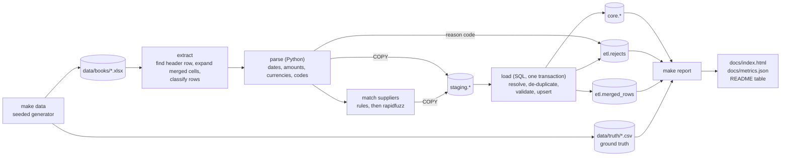
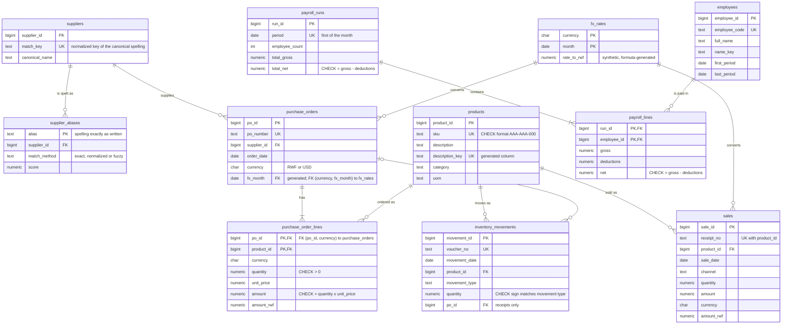

# erp-migration-demo

[](https://github.com/lokaz-c/erp-migration-demo/actions/workflows/ci.yml)

> **Synthetic data, reconstructed approach.** This repository reconstructs, on
> generated data, the approach used to migrate a fashion manufacturer's Excel
> books into a normalized SQL database. It is **not DIKAM Fashion's production
> code or data**. Every supplier, product, employee, salary and amount here is
> synthetic (names come from Faker with a fixed seed), and every number below
> was produced by running the code.

A seeded generator writes ten years of deliberately messy Excel books
(purchases, sales, stock movements, payroll). A Python and SQL pipeline loads
them into PostgreSQL 18, and a report shows what happened to every row: loaded,
merged as a duplicate, rejected with a reason, or skipped as layout noise. The
generator also writes the ground truth, so the pipeline is scored rather than
eyeballed.

Why: migrating hand-kept books is mostly reconciliation. The same supplier is
spelt ten ways, dates are typed day-first by one clerk and month-first by the
next, amounts arrive in two currencies with the currency sometimes only inside
the text ("125,000 Frw", "$1,250.00"), and rows are keyed twice across books.
This repo shows how each of those was handled, with tests and measured results.

## Run it

Needs Docker and Python 3.11 or newer.

```sh
make demo
```

That starts PostgreSQL 18 in Docker with an empty database, generates the books
(`data/books/`, ground truth in `data/truth/`), loads them twice (the second
load must change nothing), and writes the report to
[`docs/index.html`](docs/index.html), the numbers to
[`docs/metrics.json`](docs/metrics.json), and the table below.

Other targets: `make test` (unit tests plus database tests against a throwaway
PostgreSQL 18 container), `make lint`, `make calibrate` (prints the supplier
threshold sweep), `make etl` / `make report` (run one step), `make db-reset`.

## Results

Produced by `make demo` with seed 42 and rewritten on every run; CI regenerates
it and fails if the committed copy differs. The full breakdown, with examples of
every reject reason, is in [`docs/index.html`](docs/index.html).

<!-- results:start -->
<!-- Generated by `make demo` (seed 42). Do not edit by hand. -->

| Measure | Result |
| --- | --- |
| Workbooks read (sheets read / skipped) | 42 (225 / 6) |
| Rows below a header | 21,120 |
| Loaded into core tables | 18,901 |
| Exact duplicates merged | 530 |
| Rejected with a reason code | 325 |
| Skipped layout rows (blank, subtotal, repeated header) | 1,364 |
| Row outcomes that match the ground truth | 21,107 of 21,120 (99.94%) |
| Supplier spellings collapsed into suppliers | 192 into 50 (ground truth: 30) |
| Supplier matching, pairwise precision / recall | 1.000 / 0.758 |
| Spellings left for manual review | 23 (21 are true matches) |
| Dates read correctly (parsed rows) | 16,577 of 16,577 |
| Amount and currency read correctly (parsed rows) | 9,557 of 9,557 |
| Reload of the same books: rows inserted / updated | 0 / 0 |

<!-- results:end -->

The pipeline never reads the ground truth; only the report does, after the
load. Where the outcome differs from the truth, the report lists the rows and
why (see "Against the ground truth").

## Pipeline



Parsing is row-local, so it lives in Python where it is easy to unit test.
Everything that needs the whole data set (product and employee lookups,
de-duplication across books, purchase-order headers, reconciliation) is SQL in
[`src/erp_migration/sql/`](src/erp_migration/sql/).

## Schema



Two more schemas sit beside `core`: `staging` holds every source row as read
(`staging.rows`, with the original cells as `jsonb`) plus the parsed rows per
domain, and `etl` holds `reject_reasons`, `rejects` (one row per rejected or
skipped source row, with its reason code), `merged_rows` (each duplicate and the
row it was merged into) and `load_runs`. Every core record keeps the book, sheet
and row it came from, so "loaded" is checked against the core tables instead of
being assumed.

## How the hard parts work

**Finding the table.** The header row is found by scoring the first rows of
each sheet against a synonym list ("PO No", "Order No.", "PO #"), after
expanding merged cells, so title rows and two-level headers ("Amount" over
"Value | Currency") are read correctly. A currency in a header ("Amount (Frw)")
is kept as a hint. Sheets with no recognisable header (notes, summaries) are
skipped and listed in the report.

**Dates, including day/month order.** Real Excel dates, serial numbers, ISO
text and text months are unambiguous. For slashed dates, any value with a part
above 12 is evidence for its sheet's convention. An ambiguous value (both parts
12 or less) takes the sheet's convention when the evidence is one-sided, else
the workbook's; when a sheet shows both conventions (two clerks), it is resolved
from the nearest unambiguous dates above and below it, because books are kept in
date order. If nothing settles it, the row is rejected as `AMBIGUOUS_DATE`
rather than guessed. The full rule is in
[`parsing/dates.py`](src/erp_migration/parsing/dates.py).

**Amounts and currencies.** Parsers handle "125,000/=", "125 000", "RWF
125,000", "$1,250.50", "(1,250)" and "1.250,50". A currency column wins, then a
marker in the amount text, then the header; a column that contradicts the text
is `CURRENCY_CONFLICT`. USD amounts are converted with `core.fx_rates`, which is
a **synthetic** table generated from a formula (1000 RWF per USD in January
2015 plus 5 per month), labelled as such in the database. It stands in for
official rates and is deliberately not market data.

**Supplier names.** First deterministic rules (case, punctuation, "&" and
"and", legal forms such as "Ltd" / "Limited" / "S.A.R.L.", standard
abbreviations, a trade word glued to the name), then fuzzy matching with
rapidfuzz. Two keys are compared as whole names and on their identifying part
(the name minus generic trade words); the score is the lower of the two, so
"Rose Cloth Merchants" does not match "Rhodes Cloth Merchants" on the strength
of "Cloth Merchants". Scores at or above the auto-merge threshold merge; scores
between the review and auto-merge thresholds are listed for a person. The
thresholds come from `make calibrate`, which sweeps them on data from five
other seeds (never the one being scored) and picks the highest recall with
pooled precision of at least 0.99: a wrong merge corrupts two suppliers'
payables history, a missed one is a duplicate supplier someone can merge later.
A unit test fails if the configured thresholds drift from what calibration
picks.

**Duplicates.** Each domain has a natural key (PO number and product, receipt
and product, voucher number, month and employee). Rows are ranked within the
key with `row_number() over (partition by key order by book, sheet, row)`; the
first is kept, later identical rows go to `etl.merged_rows`, and later rows
with different values are rejected as `CONFLICTING_DUPLICATE`. Book names use
`COLLATE "C"`: under the default `en_US` collation,
`purchases_2019_revised.xlsx` sorts before `purchases_2019.xlsx`, which would
quietly keep the wrong copy.

**Idempotent loads.** Every core table is loaded with `INSERT ... ON CONFLICT
DO UPDATE ... WHERE (old values) IS DISTINCT FROM (new values)`, and each
statement counts its inserts and updates with PostgreSQL 18's `RETURNING
old.* / new.*`. A reload of the same books reports zero inserts and zero
updates; a test changes one row and checks that exactly one row is updated back.

**Constraints as the last line of defence.** Parsing and the SQL validation
reject bad rows before they reach `core`, but the schema enforces the same rules
anyway: CHECK constraints (quantities, `amount = quantity x unit_price`, `net =
gross - deductions`, stock sign by movement type, SKU format), foreign keys
(including a composite `(po_id, currency)` key so a line cannot be in a
different currency from its order, and `(currency, month)` to `fx_rates` so
every amount has a rate) and unique keys. Tests insert bad rows and expect the
database to refuse them.

**Reconciliation.** The report runs the checks a month-end close relies on as
SQL over the loaded tables: goods received against purchase orders (full outer
join), running stock balance per product with a window function (the true
books never go negative, so every negative balance traces to a rejected or
missing movement), and units sold in the sales book against the stock card.

More detail, written for someone reviewing the approach rather than the code:
[`docs/approach.md`](docs/approach.md).

## Repository layout

```
src/erp_migration/
  generate/   seeded generator: catalog, ten-year simulation, messy rendering, ground truth
  parsing/    dates, amounts and currencies, codes and names
  matching/   supplier matcher and threshold calibration
  etl/        extract (workbooks to rows), transform (rows to typed rows), pipeline, db helpers
  sql/        schema.sql, views.sql, load/*.sql, report/*.sql
  report/     scoring against ground truth, charts, HTML template
tests/
  unit/         parsers, matcher, extraction, generator, Python stage against ground truth
  integration/  PostgreSQL 18 via testcontainers: full load, reload, constraints, report
docs/           generated report (index.html, metrics.json) and approach.md
```

## Limitations

- **Synthetic data.** The same person wrote the generator and the parsers, so
  the mess is the mess that was anticipated. The scores against ground truth
  measure the pipeline on known kinds of mess; they say nothing about accuracy
  on real books, which always hold surprises.
- **Supplier matching uses names only.** Two different businesses whose names
  differ by one letter look exactly like a typo (the generator plants such a
  pair on purpose). The threshold is set for precision, so a share of true
  spellings stays split into extra suppliers or sits in the review queue. A real
  migration would add a second signal: tax ID, phone, bank account, or two
  spellings appearing on the same PO number. The thresholds are calibrated on
  the generator's spelling distribution, not on real names.
- **Dates.** The neighbour rule assumes books are in date order. A single
  day/month swap with both parts 12 or less, in a sheet that is otherwise
  consistent, cannot be detected by any rule here.
- **FX is simplified.** One synthetic rate per month from a formula. A real
  migration would use official daily rates, or the rate printed on each invoice,
  and agree a rounding policy with the accountant.
- **Not Odoo.** The target is a normalized schema shaped like an ERP's, not
  Odoo's own models or import API, and the custom Odoo module from the original
  project is not reconstructed here.
- **Upserts never delete.** A row removed from a book after a load stays in
  `core` until removed by hand.
- **Payroll is a sketch.** Gross, deductions and net only; no tax or social
  security rules. All people and salaries are fake.
- **Products** match by code, or by exact normalized description in books that
  had no codes; a misspelt description is rejected, not fuzzy-matched.

## Context

The original project: in summer 2025 Lorenzo Kamanzi led DIKAM Fashion's Odoo
ERP rollout in Kigali, including a custom manufacturing module and the
migration of the company's Excel purchase, sales, payroll and inventory books
into normalized SQL tables. TODO(lorenzo): real-world figures (years of books,
row counts, effect on month-end close) and confirmation of what may be shared.

## License

MIT. See [LICENSE](LICENSE).
